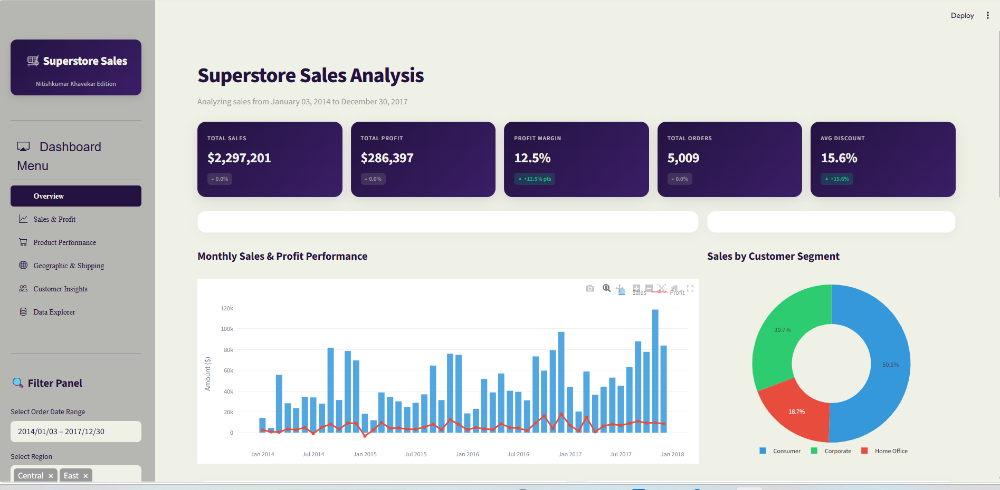

# Superstore Sales Dashboard with Streamlit


An interactive, high-performance Business Intelligence (BI) and sales analytics dashboard built from scratch using Python, Streamlit, Pandas, and Plotly.

---

## Technology Stack
- **Dashboard Framework**: Streamlit (web application wrapper)
- **Data Wrangling & Processing**: Pandas, NumPy
- **Interactive Visualizations**: Plotly Express & Plotly Graph Objects
- **Styling Layer**: Vanilla CSS3 (custom cards, transitions, custom fonts, hover effects)
- **File Export Engines**: openpyxl (Excel export), python-csv (CSV export)

---

## Features

### 1. Custom Responsive Interface
- Styled with modern typography (Outfit Google Font) and responsive glassmorphic KPI cards.
- Dark linear-gradient accenting matching the customized Streamlit theme.

### 2. Global Dynamic Filter Panel
- Date range selectors, Region, customer segment, category, and shipping mode filters.
- **Hierarchical drill-downs**: Selecting a Region dynamically updates the State options; selecting a State dynamically updates the City options.

### 3. Key Performance Indicators (KPIs)
- Real-time updates for **Total Sales**, **Total Profit**, **Profit Margin (%)**, **Total Orders**, and **Average Discount (%)**.
- Comparative badges displaying performance changes vs. the preceding period of the same duration.

### 4. Interactive Tabs / Analysis Views
1. **Overview (Executive Summary)**:
   - Monthly sales vs. profit trend chart.
   - Donut chart of sales by customer segments.
   - Bar chart of sales by category and top 5 states.
   - **Filtered Raw Data Preview** section to inspect the first 50 rows matching active filters.
2. **Sales & Profit**:
   - Month-over-month sales growth rates.
   - Customer Segment vs. Product Sub-Category profit margin heatmap.
3. **Product Performance**:
   - Sales vs. Profit correlation scatter plot (size maps quantity, color maps category).
   - Top 10 most profitable and bottom 10 loss-making products.
4. **Geographic & Shipping**:
   - Interactive US State sales volume choropleth map.
   - Average shipping delay (days between order and ship dates) by mode, alongside monthly shipping delay trends.
5. **Customer Insights**:
   - Top 10 customer list by sales and profits, and purchase frequency histograms.
6. **Data Explorer**:
   - **Browse & Export**: Dynamic column selector, text search, and download buttons to export data as CSV or Excel (`openpyxl` engine).
   - **Metadata & Diagnostics**: Displays column data types, unique counts, duplicates checks, missing values analysis, and numeric descriptive statistics.

---

## Project Structure
```
├── .streamlit/
│   └── config.toml         # Primary color themes & font config
├── data_query/
│   ├── db.sql              # Database schema definition
│   └── superstore.csv      # Raw database file (comma-separated values)
├── reports/
│   └── README.md           # Reports placeholder
├── src/
│   ├── data/
│   │   ├── Superstore.csv  # Dashboard transaction dataset (9,994 rows)
│   │   └── superstore_original.xls # Original Excel file
│   └── images/
│       └── logo.png        # Source branding asset
├── .gitignore              # Files to ignore in Git
├── app.py                  # Main Streamlit dashboard script
├── requirements.txt        # Package dependencies
└── README.md               # Project documentation
```

---

## Installation & Running

1. **Navigate to the directory**:
   ```bash
   cd E:\Superstore-Sales-Dashboard-with-Streamlit
   ```
2. **Install required packages**:
   ```bash
   pip install -r requirements.txt
   ```
3. **Run the Streamlit application**:
   ```bash
   streamlit run app.py
   ```
4. **View the dashboard** in your browser at:
   - **[http://localhost:8501](http://localhost:8501)**

---

## 🖼️ User Interface Preview



